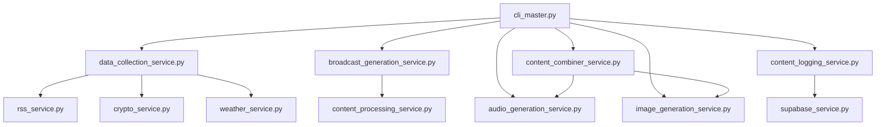

# RadioX AI News System - Modular Architecture 🚀

**RadioX** ist ein vollautomatisches AI-gesteuertes News-System, das Broadcasts mit **ElevenLabs V3 English TTS** und **DALL-E Cover-Art** generiert.

## 🏗️ Modulare Service-Architektur

### **Neue Ultra-Modulare Struktur (V3 English Default)**

RadioX ist jetzt **vollständig modular** aufgebaut - jeder Service hat eine klare Verantwortung und kann separat getestet werden:

```
🔊 Audio Generation      → Nur Audio (ElevenLabs V3 TTS)
🎨 Image Generation      → Nur Cover-Art (DALL-E)  
🔗 Content Combiner      → Audio + Cover → Final MP3
📋 Content Logging       → ALLE News + Script Protokollierung
📡 Data Collection       → RSS + Crypto + Weather Aggregation
📝 Broadcast Generation  → OpenAI Script Generation
```

### **🔄 Workflow: `Data → Script → Audio → Cover → Combine → Log`**

---

## 📁 Script-Kategorien

### **⚡ CLI Scripts (Development & Testing)**

**Zweck:** Testing, Development, Debugging  
**Location:** `/backend/cli_*.py` (Root-Level)  
**Verwendung:** Entwicklung & Einzeltests

| Script | Beschreibung | Verwendung |
|--------|-------------|------------|
| `cli_master.py` | 🚀 Master CLI für modulare Architektur | `python cli_master.py quick` |
| `cli_image.py` | 🎨 Cover-Art Service Testing | `python cli_image.py test` |
| `cli_combiner.py` | 🔗 Audio+Cover Kombination Testing | `python cli_combiner.py workflow` |
| `cli_logging.py` | 📋 Content Logging Testing | `python cli_logging.py news` |
| `cli_audio.py` | 🔊 Audio Generation Testing | `python cli_audio.py test` |
| `cli_broadcast.py` | 📝 Script Generation Testing | `python cli_broadcast.py test` |
| `cli_crypto.py` | 💰 Crypto Data Testing | `python cli_crypto.py test` |
| `cli_rss.py` | 📰 RSS Feed Testing | `python cli_rss.py test` |
| `cli_overview.py` | 📊 System Overview | `python cli_overview.py` |

### **⚙️ Service Scripts (Core Logic)**

**Zweck:** Production Services - Die eigentlichen "Arbeitstiere"  
**Location:** `/backend/src/services/*.py`  
**Verwendung:** Wird von anderen Scripts importiert

| Service | Beschreibung | Funktionalität |
|---------|-------------|----------------|
| `audio_generation_service.py` | 🔊 ElevenLabs V3 Audio Engine | Marcel & Jarvis English TTS |
| `image_generation_service.py` | 🎨 DALL-E Cover Art Engine | AI-generierte Cover-Arts |
| `content_combiner_service.py` | 🔗 Audio+Cover Kombination | Final MP3 mit eingebettetem Cover |
| `content_logging_service.py` | 📋 SQLite Content Protokollierung | ALLE News + Scripts logging |
| `broadcast_generation_service.py` | 📝 OpenAI Script Generation | V3 English Script mit Emotionen |
| `data_collection_service.py` | 📡 Data Aggregation | RSS + Crypto + Weather sammeln |
| `crypto_service.py` | 💰 Bitcoin/Crypto Data | CoinMarketCap API Integration |
| `rss_service.py` | 📰 RSS Feed Collection | Multi-Source News Aggregation |
| `weather_service.py` | 🌤️ Weather Data | Lokale Wetter-Integration |
| `supabase_service.py` | 🗄️ Database Interface | Supabase Database Operations |
| `system_monitoring_service.py` | 📊 Health & Monitoring | System Status & Performance |
| `content_processing_service.py` | 🧠 Content Analysis | News Classification & Selection |

### **🚀 Production Master Script**

| Script | Beschreibung | Verwendung |
|--------|-------------|------------|
| `radiox_master.py` | 🎯 Production Orchestrator | Scheduled Broadcasts, Live Production |

---

## 🚀 Quick Start

### **1. Installation**

```bash
# Repository klonen
git clone <repository-url>
cd RadioX/backend

# Virtual Environment erstellen
python -m venv venv
source venv/bin/activate  # macOS/Linux
# oder
venv\Scripts\activate     # Windows

# Dependencies installieren  
pip install -r requirements.txt
```

### **2. Environment Setup**

Erstelle `.env` Datei mit API Keys:

```bash
# ElevenLabs (Required für Audio)
ELEVENLABS_API_KEY=your_elevenlabs_key

# OpenAI (Required für Script & Cover)
OPENAI_API_KEY=your_openai_key

# CoinMarketCap (Required für Crypto)
COINMARKETCAP_API_KEY=your_coinmarketcap_key

# Supabase (Required für Database)
SUPABASE_URL=your_supabase_url
SUPABASE_KEY=your_supabase_key

# Weather (Optional)
WEATHER_API_KEY=your_weather_key

# ElevenLabs Voice IDs (Optional - Fallback auf Default)
ELEVENLABS_MARCEL_VOICE_ID=your_marcel_voice_id
ELEVENLABS_JARVIS_VOICE_ID=your_jarvis_voice_id
```

### **3. Schneller Test**

```bash
# System-Status prüfen
python cli_master.py status

# Schneller modularer Workflow-Test
python cli_master.py quick

# Einzelne Services testen
python cli_image.py test      # Cover-Art
python cli_audio.py test      # Audio Generation
python cli_logging.py news    # Content Logging
```

---

## 🎯 Verwendung

### **Development Workflow**

```bash
# 1. Teste einzelne Services
python cli_crypto.py test           # Crypto Data Test
python cli_rss.py test              # RSS Feed Test
python cli_broadcast.py test        # Script Generation Test

# 2. Teste modulare Services
python cli_image.py test            # Cover-Art Generation
python cli_audio.py test            # Audio Generation  
python cli_combiner.py workflow     # Audio+Cover Kombination
python cli_logging.py workflow      # Content Logging

# 3. Teste kompletten Workflow
python cli_master.py test           # Alle Services testen
python cli_master.py quick          # Schneller End-to-End Test
python cli_master.py full           # Vollständiger Workflow
```

### **Production Broadcast**

```bash
# Echter Broadcast (geplant um aktuelle Zeit)
python radiox_master.py

# Status & Monitoring
python cli_overview.py
python cli_master.py status
```

---

## 🎤 Voice Configuration (V3 English Default)

### **Primary English Speakers (Default)**
- **Marcel**: `Rachel` (21m00Tcm4TlvDq8ikWAM) - Enthusiastic Host
- **Jarvis**: `Bella` (EXAVITQu4vr4xnSDxMaL) - Analytical AI

### **Alternative English Voices**
- **Marcel Alt**: `Adam` (pNInz6obpgDQGcFmaJgB) - Confident
- **Jarvis Alt**: `Josh` (TxGEqnHWrfWFTfGW9XjX) - Professional

### **German Fallback**
- **Marcel DE**: Custom Voice ID
- **Jarvis DE**: Custom Voice ID

### **Script Format mit V3 Emotional Tags**

```
MARCEL: [excited] Welcome to RadioX! Amazing Bitcoin news today!
JARVIS: [sarcastic] Obviously predictable, Marcel.
MARCEL: [laughs] You're such a party pooper! [laughs harder]
JARVIS: [whispers] Between you and me, this is actually impressive.
```

**Verfügbare V3 Tags:** `[excited]`, `[sarcastic]`, `[whispers]`, `[laughs]`, `[curious]`, `[impressed]`

---

## 📁 Output Struktur

```
output/
├── audio/          # Einzelne Audio-Segmente & kombinierte MP3s
├── covers/         # AI-generierte Cover-Arts (DALL-E + Fallback)
└── final/          # Finale MP3s mit eingebettetem Cover

logs/
├── content/        # News & Script Logs (SQLite + JSON)
└── reports/        # Content Reports & Analytics

broadcasts/         # Archivierte Broadcasts
```

---

## 🔑 API Keys Status Check

```bash
python cli_master.py status
```

**Output:**
```
🔑 API KEYS STATUS:
   🎤 ElevenLabs: ✅ Available
   🎨 OpenAI: ✅ Available  
   💰 CoinMarketCap: ✅ Available
   🌤️ Weather: ❌ Missing (Optional)
   🗄️ Supabase: ✅ Available
```

---

## 🧪 Testing Strategy

### **Ebene 1: Individual Service Tests**
```bash
python cli_crypto.py test    # Crypto API
python cli_rss.py test       # RSS Feeds  
python cli_image.py test     # DALL-E Cover
python cli_audio.py test     # ElevenLabs TTS
```

### **Ebene 2: Modular Workflow Tests**
```bash
python cli_combiner.py workflow   # Audio + Cover Kombination
python cli_logging.py workflow    # Content Protokollierung  
```

### **Ebene 3: End-to-End Tests**
```bash
python cli_master.py quick   # Schneller Workflow
python cli_master.py full    # Vollständiger Workflow
python cli_master.py test    # Alle Services
```

---

## 🏗️ Architektur-Prinzipien

### **1. Modularität**
- Jeder Service hat **eine klare Verantwortung**
- Services können **separat getestet** werden
- **Loose Coupling** zwischen Services

### **2. Testbarkeit**
- CLI Scripts für **isolierte Tests**
- **Mock-Daten** für Development
- **Umfassende Test-Coverage**

### **3. Skalierbarkeit**
- Services können **unabhängig** erweitert werden
- **Plugin-Architektur** für neue Features
- **Horizontale Skalierung** möglich

### **4. Robustheit**
- **Graceful Degradation** bei API-Ausfällen
- **Fallback-Mechanismen** für alle kritischen Services
- **Umfassendes Error-Handling**

---

## 📊 Service Dependencies



---

## 🔧 Development Guidelines

### **Neue Services hinzufügen:**

1. **Service erstellen:** `src/services/new_service.py`
2. **CLI Test erstellen:** `cli_new.py`
3. **Service in Master integrieren:** `cli_master.py`
4. **Tests schreiben:** `test_new_service()`

### **Service Interface Standard:**

```python
class NewService:
    def __init__(self):
        # Service-spezifische Konfiguration
        
    async def main_function(self, input_data):
        # Hauptfunktionalität
        return {"success": True, "data": result}
        
    async def test_service(self):
        # Service-Test für CLI
        return True/False
```

### **Error Handling Standard:**

```python
try:
    result = await some_operation()
    return {"success": True, "data": result}
except Exception as e:
    logger.error(f"Service Error: {e}")
    return {"success": False, "error": str(e)}
```

---

## 📈 Performance & Monitoring

### **Performance Metrics:**
- Audio Generation: ~10-15 Sekunden für 2-3 Minuten Audio
- Cover Generation: ~20-30 Sekunden (DALL-E 3)
- Script Generation: ~5-10 Sekunden  
- Data Collection: ~3-5 Sekunden

### **Monitoring Commands:**
```bash
python cli_overview.py           # System Overview
python cli_master.py status      # Architecture Status
python cli_logging.py reports    # Content Reports
```

---

## 🚨 Troubleshooting

### **Häufige Probleme:**

**1. API Key Fehler**
```bash
python cli_master.py status      # Check API Keys
```

**2. Service-spezifische Tests**
```bash
python cli_crypto.py test        # Test Crypto API
python cli_rss.py test          # Test RSS Feeds
```

**3. Audio Generation Probleme**
```bash
python cli_audio.py test        # Test ElevenLabs
```

**4. Cover Generation Probleme**
```bash
python cli_image.py test        # Test DALL-E
```

**5. Database Probleme**
```bash
python cli_logging.py news      # Test SQLite
```

---

## 🎯 Roadmap

### **V3.1 Geplante Features:**
- [ ] Real-time Streaming Integration
- [ ] Multi-Language Support (French, Spanish)
- [ ] Advanced Voice Cloning
- [ ] Custom Music Integration
- [ ] Web Dashboard
- [ ] API Endpoints für externe Integration

### **V3.2 Advanced Features:**
- [ ] AI-generierte Musik
- [ ] Video Generation
- [ ] Social Media Integration
- [ ] Analytics Dashboard
- [ ] Cloud Deployment

---

## 🤝 Contributing

1. Fork das Repository
2. Erstelle Feature Branch (`git checkout -b feature/amazing-feature`)
3. Teste deine Changes (`python cli_master.py test`)
4. Commit deine Changes (`git commit -m 'Add amazing feature'`)
5. Push to Branch (`git push origin feature/amazing-feature`)
6. Erstelle Pull Request

---

## 📄 License

[Specify License]

---

## 🙏 Acknowledgments

- **ElevenLabs** für V3 TTS Technology
- **OpenAI** für GPT-4 & DALL-E 3
- **CoinMarketCap** für Crypto Data
- **Supabase** für Database Services

---

**Made with ❤️ by RadioX AI Team**

---

## 📞 Support

Bei Fragen oder Problemen:
1. Checke das Troubleshooting Section
2. Führe `python cli_master.py test` aus
3. Erstelle ein Issue mit detaillierter Beschreibung

**RadioX V3 - Vollautomatische AI News Broadcasts mit modularer Architektur! 🚀** 