# 🏗️ System Architecture

<div align="center">


**🏛️ Complete guide to RadioX system design and architecture**

[🏠 Documentation](../) • [👨‍💻 Developer Guides](../README.md#-developer-guides) • [🔧 Development](development.md) • [🧪 Testing](testing.md)

</div>

---

## 🎯 Overview

RadioX follows **Enterprise Clean Architecture** principles with clear separation of concerns, dependency inversion, and service-oriented design.

### ✨ **Architectural Principles**
- 🏗️ **Clean Architecture** - 4-layer separation (Services, CLI, Production, Config)
- 🔄 **Service-Oriented** - Loosely coupled, highly cohesive services
- 📦 **Modular Design** - Each service has single responsibility
- 🚀 **Deployment Ready** - Production wrappers for microservices

---

## 🏛️ High-Level Architecture

```
📻 RadioX - Enterprise AI Radio Platform
┌─────────────────────────────────────────────────────────────┐
│                    🌐 Web Interface                         │
│                   (Next.js Frontend)                       │
└─────────────────────┬───────────────────────────────────────┘
                      │
┌─────────────────────▼───────────────────────────────────────┐
│                 📡 API Layer                                │
│                (FastAPI Backend)                           │
└─────────────────────┬───────────────────────────────────────┘
                      │
┌─────────────────────▼───────────────────────────────────────┐
│              🎛️ RadioX Master Controller                   │
│           (Orchestrates all services)                      │
└─────┬─────┬─────┬─────┬─────┬─────┬─────┬─────┬─────┬─────┘
      │     │     │     │     │     │     │     │     │
      ▼     ▼     ▼     ▼     ▼     ▼     ▼     ▼     ▼
   ┌────┐┌────┐┌────┐┌────┐┌────┐┌────┐┌────┐┌────┐┌────┐
   │📊  ││🔄  ││🎭  ││🔊  ││🎨  ││📈  ││📰  ││🌤️ ││₿   │
   │Data││Proc││Bcast││Audio││Image││Mon ││RSS ││Wthr││Crypto│
   │Coll││ess ││Gen ││Gen ││Gen ││itor││    ││    ││     │
   └────┘└────┘└────┘└────┘└────┘└────┘└────┘└────┘└────┘
      │     │     │     │     │     │     │     │     │
      └─────┴─────┴─────┴─────┴─────┴─────┴─────┴─────┴─────┐
                                                            │
                        ┌───────────────────────────────────▼┐
                        │         🗄️ Supabase Database       │
                        │    (News, Scripts, Logs, Config)   │
                        └─────────────────────────────────────┘
```

---

## 📁 Directory Structure

### **🏗️ Clean Architecture Layers**

```
📁 backend/
├── 🎯 src/services/          # BUSINESS LOGIC LAYER
│   ├── data_collection_service.py      # 📊 Data aggregation
│   ├── content_processing_service.py   # 🔄 Content analysis
│   ├── broadcast_generation_service.py # 🎭 Script generation
│   ├── audio_generation_service.py     # 🔊 Audio production
│   ├── image_generation_service.py     # 🎨 Cover art creation
│   ├── system_monitoring_service.py    # 📈 System monitoring
│   ├── rss_service.py                  # 📰 RSS feed management
│   ├── bitcoin_service.py              # ₿ Bitcoin data
│   ├── weather_service.py              # 🌤️ Weather data
│   └── supabase_service.py             # 🗄️ Database interface
│
├── 🔧 cli/                   # PRESENTATION LAYER (Development)
│   ├── cli_master.py         # 🎛️ Master CLI controller
│   ├── cli_schema.py         # 🗄️ Database schema management
│   ├── cli_audio.py          # 🔊 Audio service testing
│   ├── cli_image.py          # 🎨 Image service testing
│   ├── cli_broadcast.py      # 🎭 Broadcast testing
│   ├── cli_bitcoin.py        # ₿ Bitcoin service testing
│   ├── cli_rss.py            # 📰 RSS service testing
│   └── cli_overview.py       # 📊 System overview
│
├── 🚀 production/            # DEPLOYMENT LAYER
│   ├── radiox_master.py      # 🎯 Full orchestration
│   └── rss_handler.py        # 📰 Standalone RSS service
│
├── ⚙️ config/                # CONFIGURATION LAYER
│   ├── settings.py           # 🔧 Centralized settings
│   └── voice_config.py       # 🎤 Voice configurations
│
└── 🗄️ database/             # DATA ACCESS LAYER
    ├── supabase_client.py    # 🔗 Database connection
    └── schema_manager.py     # 🏗️ Centralized schema management
```

---

## 🔄 Service Architecture

### **📦 Core Services**

| 🎯 Service | 📝 Responsibility | 🔗 Dependencies |
|------------|-------------------|-----------------|
| **📊 DataCollectionService** | Aggregate data from all sources | RSS, Bitcoin, Weather services |
| **🔄 ContentProcessingService** | Analyze and optimize content | DataCollection output |
| **🎭 BroadcastGenerationService** | Generate AI scripts with GPT-4 | Processed content, OpenAI API |
| **🔊 AudioGenerationService** | Create audio with ElevenLabs V3 | Broadcast scripts, ElevenLabs API |
| **🎨 ImageGenerationService** | Generate cover art with DALL-E | Broadcast content, OpenAI API |
| **📈 SystemMonitoringService** | Monitor system health & logs | Supabase, all service metrics |
| **📰 RSSService** | RSS feeds with HTML dashboard | RSS Feed Preferences DB |
| **₿ BitcoinService** | Bitcoin price & market analysis | CoinMarketCap API |
| **🌤️ WeatherService** | Swiss weather with smart outlook | OpenWeatherMap API |
| **🗄️ SchemaManager** | Database schema management | Supabase, dependency resolution |

### **🔗 Service Dependencies**

```mermaid
graph TD
    A[📊 DataCollectionService] --> B[🔄 ContentProcessingService]
    B --> C[🎭 BroadcastGenerationService]
    C --> D[🔊 AudioGenerationService]
    C --> E[🎨 ImageGenerationService]
    
    A --> F[📰 RSSService]
    A --> G[₿ BitcoinService]
    A --> H[🌤️ WeatherService]
    
    D --> I[🗄️ SupabaseService]
    E --> I
    C --> I
    
    J[📈 SystemMonitoringService] --> I
    
    K[🎛️ RadioXMaster] --> A
    K --> B
    K --> C
    K --> D
    K --> E
    K --> J
```



---

## 🎛️ Master Controller Pattern

### **🎯 RadioXMaster Orchestration**

The `RadioXMaster` class implements the **Orchestrator Pattern**:

```python
class RadioXMaster:
    def __init__(self):
        # Initialize all services
        self.data_collector = DataCollectionService()
        self.content_processor = ContentProcessingService()
        self.broadcast_generator = BroadcastGenerationService()
        self.audio_generator = AudioGenerationService()
        self.system_monitor = SystemMonitoringService()
    
    async def generate_complete_broadcast(self, **params):
        # 1. Data Collection Phase
        raw_data = await self.data_collector.collect_all_data()
        
        # 2. Content Processing Phase
        processed_content = await self.content_processor.process_content(raw_data)
        
        # 3. Script Generation Phase
        broadcast_script = await self.broadcast_generator.generate_broadcast(processed_content)
        
        # 4. Audio Production Phase (optional)
        if generate_audio:
            audio_files = await self.audio_generator.generate_audio_with_cover(broadcast_script)
        
        # 5. Monitoring Phase
        await self.system_monitor.log_broadcast_creation(broadcast_script["session_id"])
        
        return complete_broadcast
```

---

## 🔧 Configuration Management

### **⚙️ Centralized Settings**

```python
# config/settings.py
class Settings:
    # API Keys
    openai_api_key: str
    elevenlabs_api_key: str
    coinmarketcap_api_key: str
    
    # Database
    supabase_url: str
    supabase_key: str
    
    # Voice Configuration
    marcel_voice_id: str = "21m00Tcm4TlvDq8ikWAM"  # Rachel
    jarvis_voice_id: str = "EXAVITQu4vr4xnSDxMaL"  # Bella
    
    # System Configuration
    default_news_count: int = 4
    max_news_age_hours: int = 1
    supported_languages: List[str] = ["en", "de"]
```

### **🎤 Voice Configuration**

```python
# config/voice_config.py
VOICE_CONFIGURATIONS = {
    "marcel": {
        "voice_id": "21m00Tcm4TlvDq8ikWAM",
        "settings": {
            "stability": 0.75,
            "similarity_boost": 0.85,
            "style": 0.65,
            "use_speaker_boost": True
        }
    },
    "jarvis": {
        "voice_id": "EXAVITQu4vr4xnSDxMaL",
        "settings": {
            "stability": 0.80,
            "similarity_boost": 0.90,
            "style": 0.60,
            "use_speaker_boost": True
        }
    }
}
```

---

## 🗄️ Database Schema Architecture

### **🏗️ Centralized Schema Management (v3.2.0)**

RadioX implements **enterprise-grade schema management** that replaced 15+ fragmented legacy tables with a clean, dependency-resolved architecture.

#### **📊 Schema Evolution**

| 🕐 Phase | 📋 Tables | 🎯 Status |
|----------|-----------|-----------|
| **Legacy (v1.0)** | 15+ fragmented tables | ❌ Removed |
| **Cleanup (v3.1)** | 9 tables removed | ✅ Completed |
| **Current (v3.2)** | 6 optimized tables | ✅ Active |

#### **🔄 Current Schema (6 Tables)**

```
🗄️ RadioX Database Schema v3.2.0
┌─────────────────────────────────────────────────────────────┐
│                    📊 Base Tables                           │
├─────────────────────┬───────────────────────────────────────┤
│ voice_configurations │ rss_feed_preferences                 │
│ (ElevenLabs voices) │ (RSS feed management)                │
└─────────┬───────────┴─────────┬─────────────────────────────┘
          │                     │
          ▼                     ▼
┌─────────────────────────────────────────────────────────────┐
│                  show_presets                               │
│            (Show configuration templates)                   │
└─────────────────────┬───────────────────────────────────────┘
                      │
                      ▼
┌─────────────────────────────────────────────────────────────┐
│                broadcast_scripts                            │
│              (Generated radio scripts)                      │
└─────┬─────────────────────────────────┬─────────────────────┘
      │                                 │
      ▼                                 ▼
┌─────────────────┐           ┌─────────────────────────────┐
│   used_news     │           │     broadcast_logs          │
│ (News tracking) │           │   (System monitoring)       │
└─────────────────┘           └─────────────────────────────┘
```

#### **🔧 Schema Manager Features**

- **🏗️ Dependency Resolution** - Automatic table creation order
- **🧪 Built-in Testing** - Schema integrity validation
- **🧹 Automated Cleanup** - Old data management functions
- **📊 Comprehensive CLI** - Professional management tools
- **🔄 Migration Support** - Seamless schema updates

#### **📋 Legacy Cleanup (December 2024)**

**Removed Tables:**
```bash
# Old Content System (4 tables)
content_categories, content_sources, content_rules, news_content

# Old Stream System (4 tables)  
streams, stream_segments, spotify_tracks, generation_logs

# Old Configuration (1 table)
radio_stations → replaced by show_presets
```

**Result:** Clean architecture with **60% fewer tables** and **100% better maintainability**.

---

## 🚀 Deployment Architecture

### **🐳 Microservice Deployment**

```yaml
# docker-compose.yml
version: '3.8'
services:
  radiox-master:
    build: .
    environment:
      - OPENAI_API_KEY=${OPENAI_API_KEY}
      - ELEVENLABS_API_KEY=${ELEVENLABS_API_KEY}
    volumes:
      - ./output:/app/output
    
  rss-handler:
    build: .
    command: python production/rss_handler.py --action recent
    environment:
      - SUPABASE_URL=${SUPABASE_URL}
      - SUPABASE_KEY=${SUPABASE_KEY}
```

### **☸️ Kubernetes Deployment**

```yaml
apiVersion: apps/v1
kind: Deployment
metadata:
  name: radiox-master
spec:
  replicas: 2
  selector:
    matchLabels:
      app: radiox-master
  template:
    metadata:
      labels:
        app: radiox-master
    spec:
      containers:
      - name: radiox-master
        image: radiox/master:latest
        env:
        - name: OPENAI_API_KEY
          valueFrom:
            secretKeyRef:
              name: radiox-secrets
              key: openai-api-key
```

---

## 🔄 Data Flow

### **📊 Complete Broadcast Generation Flow**

```
1. 📡 Data Collection
   ├── 📰 RSS Feeds (25+ sources)
   ├── ₿ Crypto Data (CoinMarketCap)
   └── 🌤️ Weather Data (OpenWeatherMap)
   
2. 🔄 Content Processing
   ├── 📊 News Analysis & Categorization
   ├── 🎯 Content Selection (time-based)
   └── 📝 Context Preparation
   
3. 🎭 Script Generation
   ├── 🤖 GPT-4 Prompt Creation
   ├── 🎪 Style Adaptation (time-based)
   └── 📜 Dialogue Generation
   
4. 🔊 Audio Production
   ├── 🎤 ElevenLabs V3 TTS
   ├── 🎨 DALL-E 3 Cover Generation
   └── 🎵 MP3 Assembly & Embedding
   
5. 📈 Monitoring & Logging
   ├── 🗄️ Database Storage
   ├── 📊 Metrics Collection
   └── 🚨 Error Tracking
```

---

## 🧪 Testing Architecture

### **🔬 4-Level Testing Strategy**

| 🎯 Level | 📝 Purpose | 🛠️ Tools |
|----------|------------|----------|
| **Unit Tests** | Individual service testing | pytest, unittest |
| **Integration Tests** | Service interaction testing | CLI test scripts |
| **System Tests** | End-to-end workflow testing | radiox_master.py |
| **Production Tests** | Live environment validation | Monitoring services |

### **🧪 Test Commands**

```bash
# Level 1: Unit Tests
python cli/cli_crypto.py test
python cli/cli_rss.py test

# Level 2: Integration Tests
python cli/cli_master.py test

# Level 3: System Tests
python production/radiox_master.py --action test_services

# Level 4: Production Tests
python production/radiox_master.py --action system_status
```

---

## 💡 Design Patterns

### **🎯 Implemented Patterns**

| 🏗️ Pattern | 📍 Location | 📝 Purpose |
|------------|-------------|------------|
| **Service Layer** | `src/services/` | Business logic encapsulation |
| **Facade** | `RadioXMaster` | Simplified interface to complex subsystem |
| **Factory** | Voice configurations | Create voice instances |
| **Observer** | System monitoring | Event-driven logging |
| **Strategy** | Broadcast styles | Time-based style selection |
| **Dependency Injection** | Service initialization | Loose coupling |

### **🔄 Service Interface Pattern**

```python
class BaseService:
    async def test_service(self) -> bool:
        """Standard test interface for all services"""
        pass
    
    async def get_status(self) -> Dict[str, Any]:
        """Standard status interface for all services"""
        pass
```

---

## 🔗 Related Guides

- **🔧 [Development](development.md)** - Setup development environment
- **🧪 [Testing](testing.md)** - Testing strategies and tools
- **🤝 [Contributing](contributing.md)** - Code standards and workflow
- **🚀 [Production](../deployment/production.md)** - Deploy the architecture

---

<div align="center">

**🏗️ Architecture designed for scale and maintainability!**

[🏠 Documentation](../) • [🔧 Development Setup](development.md) • [💬 Get Help](../README.md#-support)

</div> 